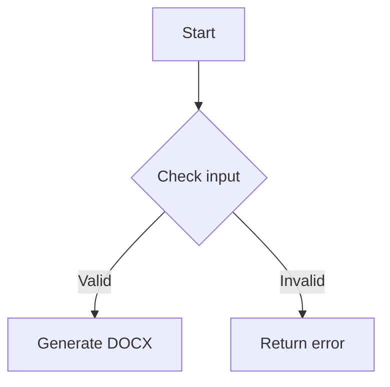

# AI Group Markdown to Word MCP Server

[](https://opensource.org/licenses/MIT)
[](https://nodejs.org)
[](https://modelcontextprotocol.io)

A comprehensive Model Context Protocol (MCP) server for converting Markdown documents to professional Word documents with advanced formatting, styling, and layout capabilities.

## 🌟 Features

### Core Conversion
- **Full Markdown Support**: Complete Markdown syntax including headings, paragraphs, lists, tables, code blocks, and blockquotes
- **Advanced Styling System**: Comprehensive style configuration with themes, templates, and custom styling
- **Professional Document Layout**: Page setup, margins, orientation, and document structure

### Advanced Features
- **Mathematical Formulas**: LaTeX math formula support with inline and block rendering
- **Table Processing**: Advanced table styling with 12+ preset styles, CSV/JSON data import
- **Image Support**: Local and remote image embedding with automatic scaling and formatting
- **Mermaid Diagrams**: Render ```mermaid code blocks into diagram images embedded in DOCX, with safe fallback to code blocks if rendering fails
- **Header & Footer**: Complete header/footer system with page numbers, total pages, and custom content
- **Table of Contents**: Automatic TOC generation with configurable levels and styling
- **Watermarks**: Text watermarks with configurable position, rotation, and transparency

### MCP Integration
- **Multiple Transports**: Support for STDIO and Streamable HTTP transports
- **Tool-based Interface**: Clean MCP tool interface for document conversion
- **Resource Templates**: Pre-built document templates for various use cases
- **Prompt System**: Intelligent prompts for user guidance and troubleshooting

### HTTP API & OpenAI Plugin Support
- **Dual API Support**: Both MCP protocol and simplified HTTP API endpoints
- **OpenAI Plugin Compatible**: Full OpenAI plugin specification support
- **RESTful Endpoints**: Simple REST API for easy integration
- **OpenAPI Specification**: YAML and JSON API documentation available

## 🚀 Quick Start

### Installation

```bash
# Using npx (recommended for one-time use)
npx -y aigroup-mdtoword-mcp

# Or install globally
npm install -g aigroup-mdtoword-mcp
```

### Usage with Claude Desktop

Add to your Claude Desktop configuration (`claude_desktop_config.json`):

```json
{
  "mcpServers": {
    "markdown-to-word": {
      "command": "npx",
      "args": ["-y", "aigroup-mdtoword-mcp"]
    }
  }
}
```

### Usage with Other MCP Clients

```json
{
  "mcpServers": {
    "markdown-to-word": {
      "command": "uvx",
      "args": ["aigroup-mdtoword-mcp"]
    }
  }
}
```

## 🛠️ Available Tools

### markdown_to_docx
Convert Markdown content to Word document with full styling support.

**Input Schema:**
```typescript
{
  markdown?: string;           // Markdown content (required if inputPath not provided)
  inputPath?: string;          // Path to Markdown file
  filename: string;            // Output filename (without extension)
  outputPath?: string;         // Custom output directory
  styleConfig?: StyleConfig;   // Advanced styling configuration
}
```

**Example Usage:**
```markdown
Convert this markdown to a Word document:

# Project Report
## Executive Summary
This is a sample report with **bold text** and *italic text*.

- Feature 1: Complete Markdown support
- Feature 2: Advanced styling system
- Feature 3: Professional document layout

| Column 1 | Column 2 | Column 3 |
|----------|----------|----------|
| Data 1   | Data 2   | Data 3   |
| Data 4   | Data 5   | Data 6   |

Mathematical formula: $E = mc^2$
```

### Mermaid Example

````markdown
# System Flow


````

Mermaid fenced code blocks are rendered into diagram images in the generated Word document. If rendering fails in the current environment, the content safely falls back to a normal code block.

### table_data_to_markdown
Convert structured data (CSV/JSON) to formatted Markdown tables.

**Input Schema:**
```typescript
{
  data: string;                // CSV or JSON data
  format: 'csv' | 'json';      // Data format
  style?: string;              // Table style preset
  hasHeader?: boolean;         // Whether data includes headers
}
```

## 📚 Available Resources

### Templates
- `template://customer-analysis` - Business analysis report template
- `template://academic` - Academic paper template  
- `template://business` - Professional business report
- `template://technical` - Technical documentation
- `template://minimal` - Clean minimal template

### Style Guides
- `style-guide://quick-start` - Quick styling reference
- `style-guide://advanced` - Advanced styling options
- `style-guide://templates` - Template usage guide

### Performance Metrics
- `metrics://conversion-stats` - Conversion performance data
- `metrics://memory-usage` - Memory usage statistics

## 🎨 Styling System

### Basic Styling
```typescript
{
  document: {
    defaultFont: "宋体",
    defaultSize: 24,
    defaultColor: "000000",
    page: {
      size: "A4",
      orientation: "portrait",
      margins: { top: 1440, bottom: 1440, left: 1440, right: 1440 }
    }
  },
  headingStyles: {
    h1: { font: "黑体", size: 64, color: "000000", bold: true },
    h2: { font: "黑体", size: 32, color: "000000", bold: true }
  }
}
```

### Advanced Features
- **Theme System**: Color and font variables for consistent branding
- **Header/Footer**: Custom headers and footers with page numbers
- **Watermarks**: Text watermarks for document protection
- **Table Styling**: 12+ preset table styles with zebra striping
- **Mathematical Formulas**: Professional math formula rendering

## 📊 Table Styles

The server includes 12 professionally designed table styles:

1. **minimal** - Clean modern style with thin borders
2. **professional** - Business style with dark headers
3. **striped** - Zebra striping for better readability
4. **grid** - Complete grid borders for structured data
5. **elegant** - Double borders for formal documents
6. **colorful** - Colorful headers for vibrant presentations
7. **compact** - Minimal margins for data-dense tables
8. **fresh** - Green theme for environmental reports
9. **tech** - Blue tech theme for technical documents
10. **report** - Formal report style with double borders
11. **financial** - Right-aligned numbers for financial data
12. **academic** - Academic paper style

## 🔧 Configuration

### Style Configuration
Full style configuration supports:
- Document-level settings (fonts, colors, page setup)
- Paragraph and heading styles
- Table and list formatting
- Image and code block styling
- Header/footer configuration
- Watermark settings

### Transport Options
- **STDIO**: Standard input/output for local execution
- **Streamable HTTP**: HTTP transport for remote servers

## 📁 Project Structure

```
src/
├── index.ts                 # Main MCP server implementation
├── converter/
│   └── markdown.ts         # Markdown to DOCX converter
├── template/
│   └── presetLoader.ts     # Template system
├── types/
│   ├── index.ts           # Core types
│   ├── style.ts          # Style configuration types
│   └── template.ts       # Template types
└── utils/
    ├── tableProcessor.ts  # Table processing utilities
    ├── mathProcessor.ts   # Mathematical formula processing
    ├── imageProcessor.ts  # Image handling utilities
    ├── styleEngine.ts     # Style application engine
    └── errorHandler.ts    # Error handling utilities
```

## 🧪 Testing

Run the test suite:

```bash
npm test
```

Available test scenarios:
- Mathematical formula conversion
- Local image embedding
- Mermaid diagram rendering
- Page numbering and headers/footers
- Table styling and data import
- Complete document conversion

## 🚀 Performance

- **Fast Conversion**: Optimized processing for large documents
- **Memory Efficient**: Stream-based processing for minimal memory usage
- **Production Ready**: Robust error handling and logging
- **Scalable**: Handles documents of any size efficiently

## 🤝 Contributing

We welcome contributions! Please see our [Contributing Guidelines](CONTRIBUTING.md) for details.

1. Fork the repository
2. Create a feature branch
3. Make your changes
4. Add tests
5. Submit a pull request

## 📄 License

This project is licensed under the MIT License - see the [LICENSE](LICENSE) file for details.

## 🙏 Acknowledgments

- Built with the [Model Context Protocol SDK](https://github.com/modelcontextprotocol/servers)
- Uses [docx](https://github.com/dolanmiu/docx) for Word document generation
- Inspired by the MCP community and ecosystem

## ☁️ Cloudflare Worker Deployment

This project supports deployment to Cloudflare Workers. Follow these steps to deploy:

### Prerequisites

1. Install Node.js (version >= 18.0.0)
2. Install Wrangler CLI: `npm install -g wrangler`
3. Login to Cloudflare: `wrangler login`

### Deployment Steps

1. Update `wrangler.toml` with your account ID:
   ```toml
   [env.production]
   account_id = "your-account-id-here"  # Replace with your Cloudflare account ID
   ```

2. Deploy to Cloudflare Workers:
   ```bash
   wrangler deploy
   ```

### API Endpoints

After deployment, your service will be accessible via:

- `https://your-worker.your-subdomain.workers.dev/` - Main info page
- `https://your-worker.your-subdomain.workers.dev/health` - Health check
- `https://your-worker.your-subdomain.workers.dev/mcp` - MCP protocol endpoint
- `https://your-worker.your-subdomain.workers.dev/convert` - Simplified HTTP API
- `https://your-worker.your-subdomain.workers.dev/.well-known/ai-plugin.json` - OpenAI plugin manifest
- `https://your-worker.your-subdomain.workers.dev/openapi.yaml` - OpenAPI specification (YAML)
- `https://your-worker.your-subdomain.workers.dev/openapi.json` - OpenAPI specification (JSON)
- `https://your-worker.your-subdomain.workers.dev/logo.png` - Plugin logo

For detailed deployment instructions, see [docs/DEPLOYMENT_INSTRUCTIONS.md](./docs/DEPLOYMENT_INSTRUCTIONS.md).

## 📞 Support

- **Issues**: [GitHub Issues](https://github.com/aigroup/aigroup-mdtoword-mcp/issues)
- **Documentation**: [Full Documentation](docs/README.md)
- **Examples**: [Example Files](examples/)

---

**AI Group Markdown to Word MCP Server** - Professional document conversion powered by MCP protocol.