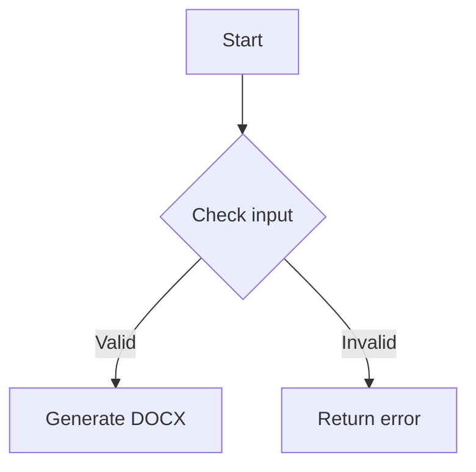

[](https://mseep.ai/app/jackdark425-aigroup-mdtoword-mcp)

# AI Group Markdown to Word MCP Server

[](./LICENSE)
[](https://nodejs.org/)
[](https://modelcontextprotocol.io)
[](https://github.com/jackdark425/aigroup-mdtoword-mcp)

> Professional Markdown-to-Word conversion over MCP, with advanced styling, tables, formulas, images, Mermaid rendering, and HTTP deployment support.

## Overview

`aigroup-mdtoword-mcp` is an MCP server for generating professional `.docx` documents from Markdown content.

It is designed for:

- converting Markdown into structured Word documents
- applying reusable templates and styling presets
- rendering tables, formulas, images, and Mermaid diagrams
- exposing both MCP and simplified HTTP endpoints
- integrating with Claude Desktop and other MCP-compatible clients

## Highlights

- **Markdown to DOCX conversion** with document styling and layout control
- **Advanced formatting** for headings, tables, lists, code blocks, and blockquotes
- **Math support** for inline and block formulas
- **Image embedding** for local and remote assets
- **Mermaid rendering** with safe fallback to code blocks
- **Header / footer / page numbering / watermark support**
- **Template, resource, and prompt support** for guided usage
- **HTTP deployment options** including Cloudflare Worker workflows

## Quick Start

### Requirements

- Node.js >= 18
- npm >= 8

### Run with npx

```bash
npx -y aigroup-mdtoword-mcp
```

### Install locally

```bash
git clone https://github.com/jackdark425/aigroup-mdtoword-mcp.git
cd aigroup-mdtoword-mcp
npm install
npm run build
npm start
```

## MCP Client Configuration

### Claude Desktop / compatible MCP clients

```json
{
  "mcpServers": {
    "markdown-to-word": {
      "command": "npx",
      "args": ["-y", "aigroup-mdtoword-mcp"]
    }
  }
}
```

### Local build output

```json
{
  "mcpServers": {
    "markdown-to-word": {
      "command": "node",
      "args": ["/path/to/aigroup-mdtoword-mcp/dist/index.js"]
    }
  }
}
```

## Tools

### `markdown_to_docx`
Converts Markdown content or a Markdown file into a `.docx` document.

Typical inputs include:

- `markdown`
- `inputPath`
- `filename`
- `outputPath`
- `styleConfig`

### `table_data_to_markdown`
Converts CSV or JSON tabular data into formatted Markdown tables.

Typical inputs include:

- `data`
- `format`
- `style`
- `hasHeader`

## Resources

### Templates
- `template://customer-analysis`
- `template://academic`
- `template://business`
- `template://technical`
- `template://minimal`

### Style Guides
- `style-guide://quick-start`
- `style-guide://advanced`
- `style-guide://templates`

### Metrics
- `metrics://conversion-stats`
- `metrics://memory-usage`

## Styling Capabilities

The styling system supports:

- document-level fonts, colors, and page layout
- heading and paragraph styles
- table presets and formatting
- image sizing and placement
- code block styling
- headers, footers, page numbers, and watermarks

Included table styles cover common business, academic, financial, technical, and minimal report layouts.

## Example

````markdown
# Project Report

## Executive Summary
This is a sample report with **bold text** and *italic text*.

- Feature 1: Complete Markdown support
- Feature 2: Advanced styling system
- Feature 3: Professional document layout

| Column 1 | Column 2 | Column 3 |
|----------|----------|----------|
| Data 1   | Data 2   | Data 3   |
| Data 4   | Data 5   | Data 6   |

Mathematical formula: $E = mc^2$


````

## Deployment

### HTTP server

```bash
npm run server:http
```

### Cloudflare Worker

```bash
npm install -g wrangler
wrangler login
wrangler deploy
```

Related endpoints typically include:

- `/health`
- `/mcp`
- `/convert`
- `/.well-known/ai-plugin.json`
- `/openapi.yaml`
- `/openapi.json`

See detailed guidance in [docs/DEPLOYMENT_INSTRUCTIONS.md](docs/DEPLOYMENT_INSTRUCTIONS.md).

## Project Structure

```text
src/
├── index.ts
├── converter/
├── template/
├── types/
└── utils/
```

## Development

```bash
npm run build
npm test
```

Additional test commands:

- `npm run test:math`
- `npm run test:images`
- `npm run test:pages`
- `npm run test:mermaid`

## License & Usage

This project is released under the **MIT License**.

In practical terms, MIT allows you to:

- use this project in personal, internal, academic, or commercial scenarios
- copy, modify, merge, publish, and distribute the code
- build proprietary or open-source products on top of it
- ship derivative works as long as the required copyright and license notice is preserved

Please keep in mind:

- **you must retain** the original copyright notice and MIT license text in copies or substantial portions of the software
- **the software is provided "AS IS"**, without warranty of any kind
- if you package this project into hosted services, desktop tools, plugins, or internal workflows, you are responsible for your own compliance, security review, and downstream usage constraints

See the full text in [LICENSE](LICENSE).

## Acknowledgments

### Core Dependencies & Ecosystem

- **Model Context Protocol SDK**
  - Repository: https://github.com/modelcontextprotocol/servers
  - Role: MCP server protocol integration

- **docx** by **Dolan Miu**
  - Repository: https://github.com/dolanmiu/docx
  - Role: core Word document generation engine

### Community Inspiration

- Inspired by the broader MCP community and ecosystem

## Support

- Issues: https://github.com/jackdark425/aigroup-mdtoword-mcp/issues
- Documentation: https://github.com/jackdark425/aigroup-mdtoword-mcp/tree/main/docs
- Examples: https://github.com/jackdark425/aigroup-mdtoword-mcp/tree/main/examples
